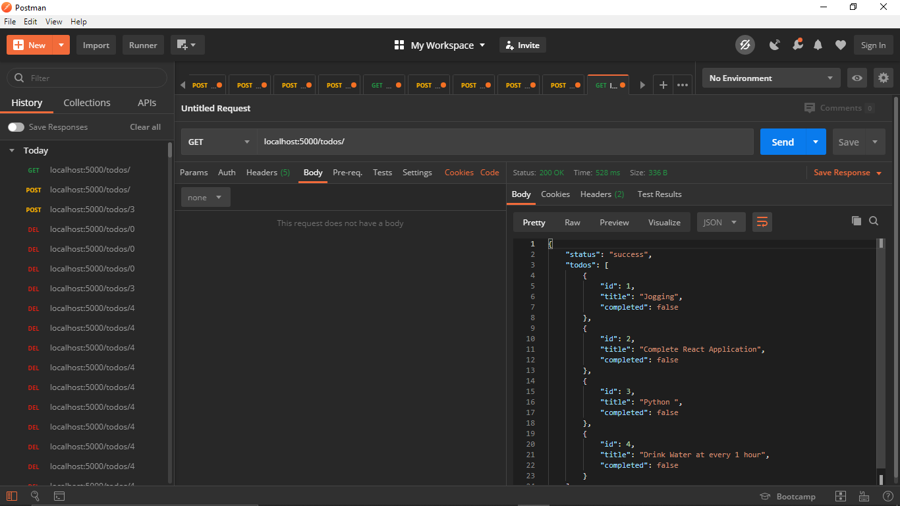
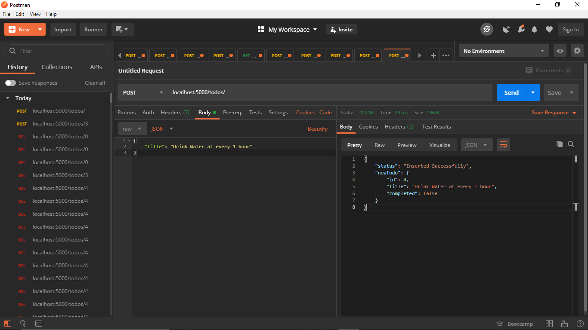
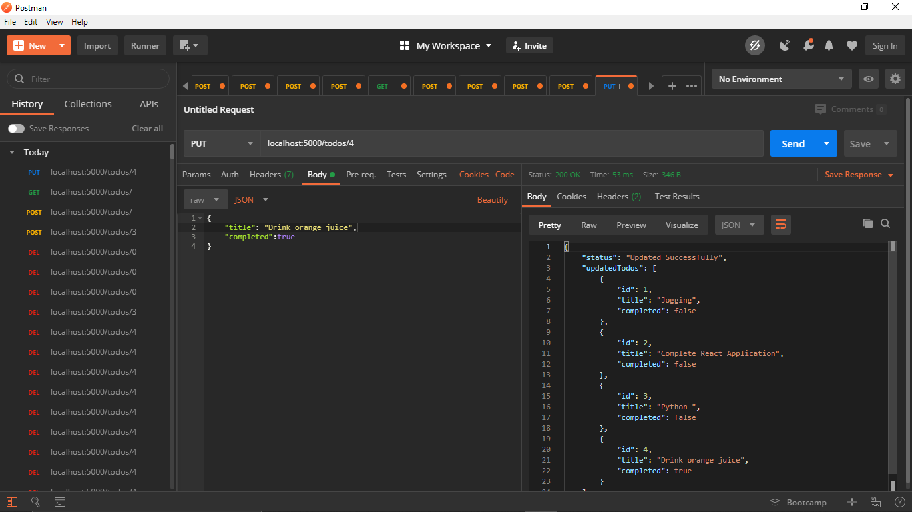
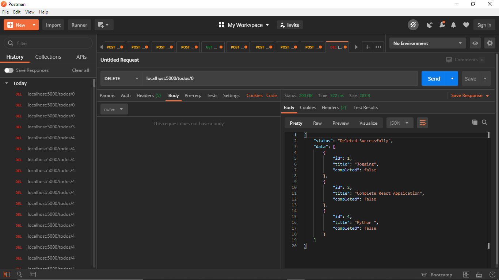

# Creating an API using DENO for a TODO Application
**Run**

```
 deno run --allow-net --allow-read --allow-write ./index.js
```

## **`GET`** - /todos


## **`POST`** - /todos (form data)


## **`PUT`** - /todos/:id


## **`DELETE`** - /todos/:id



